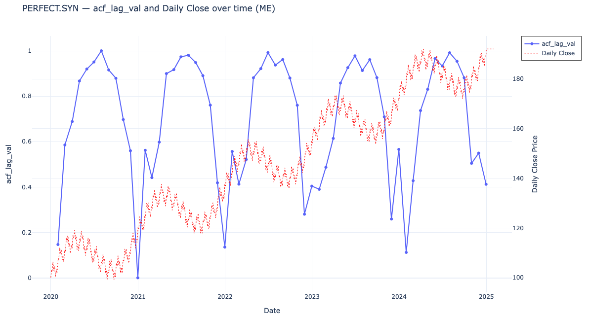

<!-- PROJECT LOGO -->
 

  

<h3 align="center">Stock Seasonality Analysis</h3>

  

    In this README you'll find everything you need to install this project
     
    <a href="https://github.com/DanielSFlamarich/stock-seasonality"><strong>Explore the docs »</strong></a>
     
    <a href="https://github.com/DanielSFlamarich/stock-seasonality/issues">Report Bug</a>
    ·
    <a href="https://github.com/DanielSFlamarich/stock-seasonality/issues">Request Feature</a>
  

<!-- TABLE OF CONTENTS -->

  
Table of Contents

  <ol>
    <li>
      <a href="#about-the-project">About The Project</a>
      <ul>
      </ul>
    </li>
    <li>
      <a href="#getting-started">Getting Started</a>
      <ul>
        <li><a href="#prerequisites">Prerequisites</a></li>
        <li><a href="#installation">Installation</a></li>
      </ul>
    </li>
    <li><a href="#usage">Usage</a></li>
    <li><a href="#contributing">Contributing</a></li>
    <li><a href="#license">License</a></li>
    <li><a href="#contact">Contact</a></li>
  </ol>

<!-- GETTING STARTED -->
## About the Project
**Stock Seasonality Analysis** is a research-focused Python project designed to explore **seasonal patterns in equities and ETFs** using publicly available data from [Yahoo Finance](https://finance.yahoo.com/). A large body of evidence showing the **limits of predictability in financial markets** exists, including **The Efficient Market Hypothesis (EMH)** where it's claimed that asset prices always reflect all available information, making it impossible to consistently outperform the market or even predict it to regularly have extraordinary benefits given that any information that could serve as an advantage is already reflected in the price. Under EMH no accurate prediction is guarenteed, but we could try to understand statistical tendencies (e.g. stronger returns in certain months or quarters) that can be useful for timing or risk management. These patterns are more likely to hold in markets influenced by cyclical demand, earnings seasons, or behavioral trends, though they can still break down due to external shocks or changing conditions. In essence, this project doesn't aim to predict the stock market but model seasonality for different frequencies. Once a possible seasonality is identified, the hypothesis is we'll be able to choose valley times for buying and peak times for selling.

<!-- GETTING STARTED -->
## Getting Started
This section helps you get the project up and running locally, step by step.

### Prerequisites

To set up your environment reliably, we recommend the following:

-   **Python 3.11+** (managed via [`pyenv`](https://github.com/pyenv/pyenv))

-   **Python package manager**[`uv`](https://github.com/astral-sh/uv)

-   **Automated linting and cleaning**[`pre-commit`](https://pre-commit.com/)

##### Install dependencies:
On macOS:
`brew install pyenv uv pre-commit`

### Installation
##### 1. Clone the repo and access its folder
`git clone https://github.com/DanielSFlamarich/stock-seasonality.git`

`cd stock-seasonality`

##### 2. **Install Python version** (if not already):
`pyenv install 3.11.9`

`pyenv local 3.11.9`

##### 3. Set up virtual environment
`uv venv`

`source .venv/bin/activate`

`uv pip sync requirements.lock`
>This will install all the pinned dependencies exactly as specified, ensuring reproducibility across environments.

##### 4. Set up pre-commit hooks
`pre-commit install`
>This registers the hooks defined in .pre-commit-config.yaml to run automatically before every commit (e.g. Black, Ruff, isort, and internal ones)

##### 5.  (Optional) Update dependencies
_If you've changed the list of top-level dependencies in `requirements.in`, regenerate the lock file:_
`uv pip compile requirements.in`
>This keeps your environment deterministic and reproducible.

(<a href="#readme-top">back to top</a>)

<!-- USAGE EXAMPLES -->
## Usage
##### 1. Validation with synthetic data

To validate our seasonality detection metrics, we generate in `notebooks/01_synth_data_validation.ipynb` a dataset with known components:
- Linear Trend
- Yearly, Monthly adn weekly seasonal patterns
- Gaussian noise

##### 2. Synthetic Data Formula

The synthetic closing price \( C_t \) is generated as:

$C_t = C_0\underbrace{\beta t}_{\text{linear trend}}\underbrace{A_y \sin\left(\frac{2\pi t}{P_y}\right)}_{\text{yearly seasonality}}\underbrace{A_m \sin\left(\frac{2\pi t}{P_m}\right)}_{\text{monthly seasonality}}\underbrace{A_w \sin\left(\frac{2\pi t}{P_w}\right)}_{\text{weekly seasonality}}\underbrace{\epsilon_t}_{\text{Gaussian noise}}$

Where:
- $( C_0 )$ — Base price (set to 100)
- $( \beta )$ — Trend coefficient
- $( A_y, A_m, A_w )$ — Amplitudes of yearly, monthly, and weekly seasonality
- $( P_y, P_m, P_w )$ — Periods of yearly (365.25), monthly (~30.4), and weekly (7) cycles
- $( \epsilon_t \sim \mathcal{N}(0, \sigma^2) )$ — Gaussian noise

This synthetic dataset is designed to:
- Provide a ground-truth time series where seasonal patterns are known a priori
- Enable unit testing and benchmarking of seasonality metrics (e.g., STL strength, spectral peaks)
- Validate the pipeline’s ability to detect multiple seasonalities across different intervals (1d, 1wk, 1mo)

##### 3. Example of metric validation

To validate our ACF lag metric, which is one of the three basic ones we use, we apply it to the fictional ticker PERFECT.SYN, which was generated with the above formula for known yearly, monthly, and weekly seasonal patterns.
The plot below overlays:
- Blue line — Autocorrelation value (acf_lag_val) at seasonal lags
- Red dotted line — Synthetic daily closing prices

Interpretation
- Strong periodic peaks in the autocorrelation confirm the presence of recurrent seasonal patterns.
- The synthetic dataset acts as a ground truth, allowing us to verify that the metric correctly identifies seasonal lags.
- This validates the robustness of our seasonality detection pipeline before applying it to real financial data.

(<a href="#readme-top">back to top</a>)

<!-- CONTRIBUTING -->
## Contributing

Contributions are great and an amazing way to learn and make the project better. Any contributions you make are **greatly appreciated**.

If you have a suggestion that would make this better, please clone the repo and create a pull request.

1. Clone the repo.
2. Create your Feature Branch (`git checkout -b feature/CreatingAmazingFeature`)
3. Commit your Changes (`git commit -m 'Added some AmazingFeature'`)
4. Push to the Branch (`git push origin feature/CreatingAmazingFeature`)
5. Open a Pull Request

It's that simple! :smile:

(<a href="#readme-top">back to top</a>)

<!-- LICENSE -->
## License

(<a href="#readme-top">back to top</a>)

